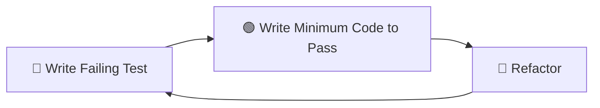

# Student Assignment: Task Management API with TDD

Build a complete Task Management API using **Test-Driven Development (TDD)** with Quart (backend) and React (frontend).

## Learning Objectives

By completing this assignment, you will:

- ✅ Practice Test-Driven Development (TDD) workflow
- ✅ Build async API endpoints with Quart
- ✅ Create React components with TypeScript
- ✅ Write comprehensive unit tests with pytest
- ✅ Write end-to-end tests with Playwright
- ✅ Follow production-ready code patterns
- ✅ Understand the Blueprint architecture pattern
- ✅ Learn proper Git workflow

---

## Assignment Overview

You'll build a **Task Management API** with the following features:

### Features to Implement

**Task Entity**:

```typescript
interface Task {
  id: number;
  title: string;
  description: string;
  status: "pending" | "in_progress" | "completed";
  created_at: string;
  updated_at: string;
}
```

**API Endpoints**:

- `POST /api/tasks` - Create a new task
- `GET /api/tasks` - List all tasks
- `GET /api/tasks/<id>` - Get single task
- `PUT /api/tasks/<id>` - Update task
- `DELETE /api/tasks/<id>` - Delete task

**Frontend Features**:

- View list of tasks
- Create new task with form
- Update task status
- Delete task
- Form validation
- Error handling

---

## Phase 0: Initial Setup

### Step 1: Create Feature Branch

Branch naming format: `KQ-XXX-your-name`

Example: If you're Maria working on assignment 001:

```bash
# Ensure you're on develop branch
git checkout develop
git pull origin develop

# Create your feature branch using KQ-XXX-your-name format
git checkout -b KQ-001-maria

# Verify you're on the new branch
git branch --show-current
# Should output: KQ-001-maria
```

**Important**: Replace `001` with your assignment number and `maria` with your name.

### Step 2: Verify Environment Setup

```bash
# 1. Activate virtual environment
source venv/bin/activate  # macOS/Linux
# or
venv\Scripts\activate     # Windows

# 2. Verify Python dependencies
python -c "import quart; print('✓ Quart installed')"
python -c "import pytest; print('✓ pytest installed')"

# 3. Verify Node dependencies
cd app/frontend
npm list react vite
cd ../..

# 4. Initialize database
python scripts/init_db.py
# Should output: "Database initialized successfully!"
```

### Step 3: Understand the Codebase Structure

Before starting, explore the existing code:

```bash
# View main application structure
tree app/backend -L 2

# Read the main app.py to understand blueprint registration
cat app/backend/app.py

# Look at existing test patterns
cat tests/unit/conftest.py
```

**Key Files to Study**:

| File                     | Purpose                  | What to Learn                  |
| ------------------------ | ------------------------ | ------------------------------ |
| `app/backend/app.py`     | Main application factory | Blueprint registration pattern |
| `app/backend/config.py`  | Configuration constants  | How to define config keys      |
| `tests/unit/conftest.py` | Test fixtures            | How to set up test database    |
| `tests/e2e/conftest.py`  | Playwright fixtures      | How to configure E2E tests     |

### Step 4: Run Existing Tests

```bash
# Run all existing tests (should pass)
pytest tests/ -v

# If you get errors, review the setup guide
```

---

## Phase 1: Backend Implementation with TDD

In this phase, you'll implement the Task API endpoints using **Test-Driven Development**.

### TDD Workflow (Red-Green-Refactor)



**Rules**:

1. **Write the test first** - Always start with a failing test
2. **Write minimum code** - Only write enough to make the test pass
3. **Run tests frequently** - After every small change
4. **Commit often** - After each test passes

---

### Task 1.1: Write Tests for POST /api/tasks

**File**: `tests/unit/test_tasks.py`

Create this file and add the following test cases:

```python
"""
Unit tests for task management endpoints.

Following TDD pattern from existing tests in this project.
Reference: tests/unit/test_reviews.py (from main project)
"""
import pytest
from datetime import datetime


@pytest.mark.asyncio
@pytest.mark.unit
async def test_create_task_success(test_client):
    """Test successful task creation with valid data.

    This test should:
    1. Send POST request to /api/tasks with valid task data
    2. Assert response status is 201 (Created)
    3. Assert response contains task with generated ID
    4. Assert response contains all submitted fields
    5. Assert created_at and updated_at are set

    Expected response:
    {
        "id": 1,
        "title": "Test Task",
        "description": "Test Description",
        "status": "pending",
        "created_at": "2024-01-01T12:00:00",
        "updated_at": "2024-01-01T12:00:00"
    }
    """
    # TODO: Mock the database for this test
    # from unittest.mock import patch, AsyncMock
    # with patch('app.backend.tasks.models.insert_task', new_callable=AsyncMock) as mock_insert:
    #     mock_insert.return_value = {...}  # mock database response

    # TODO: Implement this test
    # Hint: Use test_client.post() with json parameter

    task_data = {
        "title": "Test Task",
        "description": "Test Description",
        "status": "pending"
    }

    response = await test_client.post("/api/tasks", json=task_data)

    # TODO: Add assertions
    # assert response.status_code == 201
    # data = await response.get_json()
    # assert data["id"] is not None
    # assert data["title"] == task_data["title"]
    # ... add more assertions

    pass  # Remove this when you implement


@pytest.mark.asyncio
@pytest.mark.unit
async def test_create_task_missing_title(test_client):
    """Test task creation fails when title is missing.

    This test should:
    1. Send POST request without title field
    2. Assert response status is 400 (Bad Request)
    3. Assert error message indicates missing title

    Expected response:
    {
        "error": "Title is required",
        "field": "title"
    }
    """
    # TODO: Mock the database for this test
    # Note: For validation tests, database might not be called,
    # but good practice to mock it anyway

    # TODO: Implement this test

    task_data = {
        "description": "Description without title",
        "status": "pending"
    }

    response = await test_client.post("/api/tasks", json=task_data)

    # TODO: Add assertions
    # assert response.status_code == 400
    # data = await response.get_json()
    # assert "error" in data
    # assert "title" in data["error"].lower()

    pass  # Remove this when you implement


@pytest.mark.asyncio
@pytest.mark.unit
async def test_create_task_invalid_status(test_client):
    """Test task creation fails with invalid status.

    Valid statuses: 'pending', 'in_progress', 'completed'

    This test should:
    1. Send POST request with invalid status value
    2. Assert response status is 400 (Bad Request)
    3. Assert error message indicates invalid status

    Expected response:
    {
        "error": "Invalid status. Must be one of: pending, in_progress, completed",
        "field": "status"
    }
    """
    # TODO: Implement this test

    task_data = {
        "title": "Test Task",
        "description": "Test Description",
        "status": "invalid_status"  # Invalid!
    }

    response = await test_client.post("/api/tasks", json=task_data)

    # TODO: Add assertions
    # assert response.status_code == 400
    # data = await response.get_json()
    # assert "error" in data
    # assert "status" in data["error"].lower()

    pass  # Remove this when you implement


@pytest.mark.asyncio
@pytest.mark.unit
async def test_create_task_default_status(test_client):
    """Test task creation with default status.

    If status is not provided, it should default to 'pending'.

    This test should:
    1. Send POST request without status field
    2. Assert response status is 201 (Created)
    3. Assert returned status is 'pending'
    """
    # TODO: Implement this test

    task_data = {
        "title": "Test Task",
        "description": "Test Description"
        # No status field
    }

    response = await test_client.post("/api/tasks", json=task_data)

    # TODO: Add assertions
    # assert response.status_code == 201
    # data = await response.get_json()
    # assert data["status"] == "pending"

    pass  # Remove this when you implement
```

**Now run the tests - they should FAIL**:

```bash
pytest tests/unit/test_tasks.py -v

# Expected output:
# 4 failed (because endpoints don't exist yet)
```

---

### Task 1.2: Implement POST /api/tasks Endpoint

Now implement the minimum code to make your tests pass.

**File**: `app/backend/tasks/__init__.py`

```python
"""
Task management module.

This module provides task CRUD operations following the blueprint pattern.
"""
```

**File**: `app/backend/tasks/models.py`

```python
"""
Task data models and database operations.

Following the pattern from app/backend/reviews/services.py in the main project.
"""
from datetime import datetime
from typing import Optional


class Task:
    """Task model representing a task in the system."""

    def __init__(
        self,
        title: str,
        description: str,
        status: str = "pending",
        task_id: Optional[int] = None,
        created_at: Optional[datetime] = None,
        updated_at: Optional[datetime] = None
    ):
        self.id = task_id
        self.title = title
        self.description = description
        self.status = status
        self.created_at = created_at or datetime.utcnow()
        self.updated_at = updated_at or datetime.utcnow()

    def to_dict(self) -> dict:
        """Convert task to dictionary for JSON serialization."""
        return {
            "id": self.id,
            "title": self.title,
            "description": self.description,
            "status": self.status,
            "created_at": self.created_at.isoformat() if self.created_at else None,
            "updated_at": self.updated_at.isoformat() if self.updated_at else None
        }

    @staticmethod
    def from_dict(data: dict) -> "Task":
        """Create task from dictionary."""
        return Task(
            task_id=data.get("id"),
            title=data["title"],
            description=data.get("description", ""),
            status=data.get("status", "pending"),
            created_at=data.get("created_at"),
            updated_at=data.get("updated_at")
        )


# TODO: Implement database operations
# Reference: app/backend/utils/cosmos_helpers.py patterns

VALID_STATUSES = ["pending", "in_progress", "completed"]


async def create_task(task: Task) -> Task:
    """
    Create a new task in the database.

    Args:
        task: Task object to create

    Returns:
        Created task with generated ID

    Raises:
        ValueError: If task data is invalid
    """
    # TODO: Implement database insert
    # For now, this is a placeholder that needs database integration
    pass


async def get_task(task_id: int) -> Optional[Task]:
    """Get task by ID."""
    # TODO: Implement database query
    pass


async def get_all_tasks() -> list[Task]:
    """Get all tasks."""
    # TODO: Implement database query
    pass


async def update_task(task_id: int, updates: dict) -> Task:
    """Update task fields."""
    # TODO: Implement database update
    pass


async def delete_task(task_id: int) -> bool:
    """Delete task by ID."""
    # TODO: Implement database delete
    pass
```

**File**: `app/backend/tasks/routes.py`

```python
"""
Task API routes.

Following the blueprint pattern from app/backend/reviews/routes.py
"""
from quart import Blueprint, request, jsonify
from app.backend.tasks.models import Task, VALID_STATUSES, create_task
from app.backend.error import error_response


# Create blueprint
tasks_bp = Blueprint("tasks", __name__)


@tasks_bp.route("/api/tasks", methods=["POST"])
async def create_task_endpoint():
    """
    Create a new task.

    Request body:
    {
        "title": "Task title (required)",
        "description": "Task description (optional)",
        "status": "pending|in_progress|completed (optional, defaults to pending)"
    }

    Returns:
        201: Created task
        400: Validation error
    """
    try:
        # TODO: Implement the following:
        # 1. Get JSON data from request
        data = await request.get_json()

        # 2. Validate required fields
        if not data:
            return jsonify({"error": "Request body is required"}), 400

        if "title" not in data or not data["title"]:
            return jsonify({
                "error": "Title is required",
                "field": "title"
            }), 400

        # 3. Validate status if provided
        status = data.get("status", "pending")
        if status not in VALID_STATUSES:
            return jsonify({
                "error": f"Invalid status. Must be one of: {', '.join(VALID_STATUSES)}",
                "field": "status"
            }), 400

        # 4. Create task object
        task = Task(
            title=data["title"],
            description=data.get("description", ""),
            status=status
        )

        # 5. Save to database
        created_task = await create_task(task)

        # 6. Return created task with 201 status
        return jsonify(created_task.to_dict()), 201

    except Exception as e:
        return error_response(e, "create_task_endpoint")
```

**Register the Blueprint** in `app/backend/app.py`:

```python
from quart import Quart
from app.backend.tasks.routes import tasks_bp  # Add this import

def create_app():
    app = Quart(__name__)

    # Register blueprints
    app.register_blueprint(tasks_bp)  # Add this line

    return app
```

**Implement Database Operations** in `app/backend/core/database.py`:

```python
"""
Database helper functions.

Simple SQLite database for learning purposes.
In production, you'd use an ORM like SQLAlchemy or async Cosmos DB.
"""
import aiosqlite
import os
from datetime import datetime
from typing import Optional


DATABASE_URL = os.getenv("DATABASE_URL", "sqlite:///app.db")
DB_PATH = DATABASE_URL.replace("sqlite:///", "")


async def get_connection():
    """Get database connection."""
    return await aiosqlite.connect(DB_PATH)


async def init_db():
    """Initialize database tables."""
    async with await get_connection() as db:
        await db.execute("""
            CREATE TABLE IF NOT EXISTS tasks (
                id INTEGER PRIMARY KEY AUTOINCREMENT,
                title TEXT NOT NULL,
                description TEXT,
                status TEXT NOT NULL DEFAULT 'pending',
                created_at TEXT NOT NULL,
                updated_at TEXT NOT NULL
            )
        """)
        await db.commit()


async def clear_db():
    """Clear all tables (for testing)."""
    async with await get_connection() as db:
        await db.execute("DELETE FROM tasks")
        await db.commit()


# Task-specific database operations
async def insert_task(title: str, description: str, status: str) -> dict:
    """Insert a new task and return it."""
    now = datetime.utcnow().isoformat()

    async with await get_connection() as db:
        cursor = await db.execute(
            """
            INSERT INTO tasks (title, description, status, created_at, updated_at)
            VALUES (?, ?, ?, ?, ?)
            """,
            (title, description, status, now, now)
        )
        await db.commit()

        task_id = cursor.lastrowid

        # Fetch created task
        cursor = await db.execute(
            "SELECT * FROM tasks WHERE id = ?",
            (task_id,)
        )
        row = await cursor.fetchone()

        return {
            "id": row[0],
            "title": row[1],
            "description": row[2],
            "status": row[3],
            "created_at": row[4],
            "updated_at": row[5]
        }
```

**Update `app/backend/tasks/models.py`** to use the database:

```python
# Add this to the create_task function:
from app.backend.core.database import insert_task

async def create_task(task: Task) -> Task:
    """Create a new task in the database."""
    # Validate status
    if task.status not in VALID_STATUSES:
        raise ValueError(f"Invalid status: {task.status}")

    # Insert into database
    task_dict = await insert_task(
        title=task.title,
        description=task.description,
        status=task.status
    )

    # Return task object with ID
    return Task.from_dict(task_dict)
```

**Run the tests - they should PASS**:

```bash
pytest tests/unit/test_tasks.py -v

# Expected output:
# 4 passed ✓
```

**Commit your implementation**:

```bash
git add app/backend/tasks/
git add app/backend/core/database.py
git add app/backend/app.py
git commit -m "feat: implement POST /api/tasks endpoint with validation"
```

---

### Task 1.3: Implement Remaining CRUD Endpoints

Follow the same TDD pattern for the remaining endpoints:

**Endpoints to Implement**:

1. `GET /api/tasks` - List all tasks
2. `GET /api/tasks/<id>` - Get single task
3. `PUT /api/tasks/<id>` - Update task
4. `DELETE /api/tasks/<id>` - Delete task

**For Each Endpoint**:

1. **Write tests first** in `tests/unit/test_tasks.py`:

   ```python
   @pytest.mark.asyncio
   @pytest.mark.unit
   async def test_get_all_tasks(test_client):
       """Test fetching all tasks."""
       # TODO: Implement
       pass

   @pytest.mark.asyncio
   @pytest.mark.unit
   async def test_get_single_task(test_client):
       """Test fetching single task by ID."""
       # TODO: Implement
       pass

   # ... etc
   ```

2. **Run tests and watch them fail**:

   ```bash
   pytest tests/unit/test_tasks.py::test_get_all_tasks -v
   ```

3. **Implement the endpoint** in `app/backend/tasks/routes.py`:

   ```python
   @tasks_bp.route("/api/tasks", methods=["GET"])
   async def get_tasks():
       """Get all tasks."""
       # TODO: Implement
       pass
   ```

4. **Run tests and watch them pass**:

   ```bash
   pytest tests/unit/test_tasks.py::test_get_all_tasks -v
   ```

5. **Commit**:

   ```bash
   git add tests/unit/test_tasks.py
   git commit -m "test: add tests for GET /api/tasks"

   git add app/backend/tasks/routes.py
   git commit -m "feat: implement GET /api/tasks endpoint"
   ```

**Testing Checklist**:

- ✅ Test success cases
- ✅ Test validation errors
- ✅ Test not found errors (404)
- ✅ Test edge cases (empty lists, etc.)

---

## Phase 2: Frontend Implementation with E2E TDD

In this phase, you'll build the React frontend using **E2E Test-Driven Development**.

### Why E2E Tests for Frontend?

E2E tests verify:

- UI elements are rendered correctly
- User interactions work as expected
- API integration is correct
- Complete user flows function end-to-end

---

### Task 2.1: Write Playwright Tests First

**File**: `tests/e2e/test_tasks.py`

```python
"""
End-to-end tests for task management UI.

These tests use Playwright to simulate real user interactions.
Reference: tests/e2e/test_e2e.py from main project
"""
import pytest
from playwright.sync_api import Page, expect


@pytest.mark.e2e
def test_view_tasks_page(page: Page):
    """Test that tasks page loads and displays tasks.

    User story: As a user, I want to see a list of my tasks.

    Steps:
    1. Navigate to /tasks page
    2. Verify page title is visible
    3. Verify task list container exists
    4. Verify at least one task is displayed (from seed data)
    """
    # TODO: Mock the API endpoint for this test
    # page.route("**/api/tasks", lambda route: route.fulfill(
    #     status=200,
    #     content_type="application/json",
    #     body=json.dumps([
    #         {"id": 1, "title": "Task 1", "description": "Desc 1", "status": "pending", ...},
    #         {"id": 2, "title": "Task 2", "description": "Desc 2", "status": "in_progress", ...}
    #     ])
    # ))

    # TODO: Implement this test

    # Navigate to tasks page
    page.goto("http://localhost:5173/tasks")

    # TODO: Add assertions
    # expect(page.locator("h1")).to_contain_text("Tasks")
    # expect(page.locator('[data-testid="task-list"]')).to_be_visible()
    # expect(page.locator('[data-testid="task-card"]')).to_have_count(2)  # Based on mocked data

    pass  # Remove when implemented


@pytest.mark.e2e
def test_create_task_flow(page: Page):
    """Test the complete flow of creating a task through the UI.

    User story: As a user, I want to create a new task so I can track my work.

    Steps:
    1. Navigate to tasks page
    2. Click "New Task" button
    3. Fill in title: "Test Task"
    4. Fill in description: "Test Description"
    5. Select status: "pending"
    6. Click "Create" button
    7. Verify success message appears
    8. Verify new task appears in the list
    9. Verify task has correct title and description
    """
    # TODO: Mock the API endpoints for this test
    # Mock GET /api/tasks (initial load)
    # page.route("**/api/tasks", lambda route: route.fulfill(
    #     status=200,
    #     content_type="application/json",
    #     body=json.dumps([])
    # ), times=1)
    #
    # Mock POST /api/tasks (create new task)
    # page.route("**/api/tasks", lambda route: route.fulfill(
    #     status=201,
    #     content_type="application/json",
    #     body=json.dumps({
    #         "id": 1, "title": "Test Task", "description": "Test Description",
    #         "status": "pending", "created_at": "2024-01-01T12:00:00", ...
    #     })
    # ), method="POST")

    # TODO: Implement this test

    page.goto("http://localhost:5173/tasks")

    # Click "New Task" button
    # page.click('[data-testid="new-task-btn"]')

    # Fill form
    # page.fill('[data-testid="task-title-input"]', "Test Task")
    # page.fill('[data-testid="task-description-input"]', "Test Description")
    # page.select_option('[data-testid="task-status-select"]', "pending")

    # Submit
    # page.click('[data-testid="create-task-btn"]')

    # TODO: Add assertions
    # expect(page.locator('[data-testid="success-message"]')).to_be_visible()
    # expect(page.locator('[data-testid="task-card"]')).to_contain_text("Test Task")

    pass  # Remove when implemented


@pytest.mark.e2e
def test_create_task_validation(page: Page):
    """Test that form validation works correctly.

    User story: As a user, I should see errors if I try to create invalid tasks.

    Steps:
    1. Navigate to tasks page
    2. Click "New Task" button
    3. Leave title empty
    4. Click "Create" button
    5. Verify error message appears
    6. Verify task is NOT created
    """
    # TODO: Mock the API endpoint for this test
    # page.route("**/api/tasks", lambda route: route.fulfill(
    #     status=200,
    #     content_type="application/json",
    #     body=json.dumps([])
    # ))
    # Note: For client-side validation, API might not be called,
    # but good practice to mock it anyway

    # TODO: Implement this test

    page.goto("http://localhost:5173/tasks")

    # Click "New Task" button
    # page.click('[data-testid="new-task-btn"]')

    # Leave title empty, click create
    # page.click('[data-testid="create-task-btn"]')

    # TODO: Add assertions
    # expect(page.locator('[data-testid="error-message"]')).to_be_visible()
    # expect(page.locator('[data-testid="error-message"]')).to_contain_text("Title is required")

    pass  # Remove when implemented


@pytest.mark.e2e
def test_update_task_status(page: Page):
    """Test updating a task's status.

    User story: As a user, I want to update task status as I work.

    Steps:
    1. Navigate to tasks page
    2. Click on a task with status "pending"
    3. Change status to "in_progress"
    4. Click "Save"
    5. Verify status is updated in the UI
    """
    # TODO: Mock the API endpoints for this test
    # Mock GET /api/tasks (initial load with pending task)
    # page.route("**/api/tasks", lambda route: route.fulfill(
    #     status=200,
    #     content_type="application/json",
    #     body=json.dumps([
    #         {"id": 1, "title": "Task 1", "status": "pending", ...}
    #     ])
    # ))
    #
    # Mock PUT /api/tasks/1 (update task status)
    # page.route("**/api/tasks/1", lambda route: route.fulfill(
    #     status=200,
    #     content_type="application/json",
    #     body=json.dumps(
    #         {"id": 1, "title": "Task 1", "status": "in_progress", ...}
    #     )
    # ), method="PUT")

    # TODO: Implement this test
    pass


@pytest.mark.e2e
def test_delete_task(page: Page):
    """Test deleting a task.

    User story: As a user, I want to delete completed tasks.

    Steps:
    1. Navigate to tasks page
    2. Click on a task
    3. Click "Delete" button
    4. Confirm deletion in dialog
    5. Verify task is removed from list
    """
    # TODO: Mock the API endpoints for this test
    # Mock GET /api/tasks (initial load)
    # page.route("**/api/tasks", lambda route: route.fulfill(
    #     status=200,
    #     content_type="application/json",
    #     body=json.dumps([
    #         {"id": 1, "title": "Task 1", "status": "completed", ...}
    #     ])
    # ))
    #
    # Mock DELETE /api/tasks/1
    # page.route("**/api/tasks/1", lambda route: route.fulfill(
    #     status=204
    # ), method="DELETE")

    # TODO: Implement this test
    pass
```

**Run the tests - they should FAIL** (frontend doesn't exist yet):

```bash
# First, start the backend
cd app/backend
hypercorn main:app --bind 0.0.0.0:5000 &

# Run E2E tests
pytest tests/e2e/test_tasks.py -m e2e -v

# Expected: Tests fail because pages/routes don't exist
```

**Commit your tests**:

```bash
git add tests/e2e/test_tasks.py
git commit -m "test: add E2E tests for task management UI"
```

---

### Task 2.2: Implement React Frontend

Now implement the frontend to make E2E tests pass.

**File**: `app/frontend/src/types/task.ts`

```typescript
/**
 * Task type definitions.
 *
 * Following TypeScript patterns from the main project.
 */

export type TaskStatus = "pending" | "in_progress" | "completed";

export interface Task {
  id: number;
  title: string;
  description: string;
  status: TaskStatus;
  created_at: string;
  updated_at: string;
}

export interface CreateTaskRequest {
  title: string;
  description?: string;
  status?: TaskStatus;
}

export interface UpdateTaskRequest {
  title?: string;
  description?: string;
  status?: TaskStatus;
}
```

**File**: `app/frontend/src/api/tasks.ts`

```typescript
/**
 * Task API client functions.
 *
 * Following API client patterns from app/frontend/src/api/ in main project.
 */
import { Task, CreateTaskRequest, UpdateTaskRequest } from "../types/task";

const API_BASE = "/api";

/**
 * Fetch all tasks.
 */
export const getTasks = async (): Promise<Task[]> => {
  // TODO: Implement
  // const response = await fetch(`${API_BASE}/tasks`);
  // if (!response.ok) throw new Error('Failed to fetch tasks');
  // return response.json();

  throw new Error("Not implemented");
};

/**
 * Fetch single task by ID.
 */
export const getTask = async (id: number): Promise<Task> => {
  // TODO: Implement
  throw new Error("Not implemented");
};

/**
 * Create a new task.
 */
export const createTask = async (data: CreateTaskRequest): Promise<Task> => {
  // TODO: Implement
  // const response = await fetch(`${API_BASE}/tasks`, {
  //   method: 'POST',
  //   headers: { 'Content-Type': 'application/json' },
  //   body: JSON.stringify(data)
  // });
  // if (!response.ok) throw new Error('Failed to create task');
  // return response.json();

  throw new Error("Not implemented");
};

/**
 * Update an existing task.
 */
export const updateTask = async (
  id: number,
  data: UpdateTaskRequest
): Promise<Task> => {
  // TODO: Implement
  throw new Error("Not implemented");
};

/**
 * Delete a task.
 */
export const deleteTask = async (id: number): Promise<void> => {
  // TODO: Implement
  throw new Error("Not implemented");
};
```

**File**: `app/frontend/src/components/TaskForm.tsx`

```tsx
/**
 * Task creation/edit form component.
 *
 * Following component patterns from app/frontend/src/components/ in main project.
 */
import React, { useState } from "react";
import { CreateTaskRequest, TaskStatus } from "../types/task";

interface TaskFormProps {
  onSubmit: (data: CreateTaskRequest) => Promise<void>;
  onCancel: () => void;
  initialData?: CreateTaskRequest;
}

export const TaskForm: React.FC<TaskFormProps> = ({
  onSubmit,
  onCancel,
  initialData,
}) => {
  const [title, setTitle] = useState(initialData?.title || "");
  const [description, setDescription] = useState(
    initialData?.description || ""
  );
  const [status, setStatus] = useState<TaskStatus>(
    initialData?.status || "pending"
  );
  const [error, setError] = useState<string | null>(null);
  const [loading, setLoading] = useState(false);

  const handleSubmit = async (e: React.FormEvent) => {
    e.preventDefault();
    setError(null);

    // Validation
    if (!title.trim()) {
      setError("Title is required");
      return;
    }

    try {
      setLoading(true);
      await onSubmit({ title, description, status });
    } catch (err) {
      setError(err instanceof Error ? err.message : "Failed to save task");
    } finally {
      setLoading(false);
    }
  };

  return (
    <form onSubmit={handleSubmit} className="task-form">
      {/* TODO: Implement form JSX */}
      {/* Remember to add data-testid attributes for E2E tests! */}

      {error && (
        <div data-testid="error-message" className="error">
          {error}
        </div>
      )}

      <div>
        <label htmlFor="title">Title *</label>
        <input
          id="title"
          data-testid="task-title-input"
          type="text"
          value={title}
          onChange={(e) => setTitle(e.target.value)}
          placeholder="Enter task title"
        />
      </div>

      {/* TODO: Add description textarea */}
      {/* TODO: Add status select dropdown */}

      <div className="form-actions">
        <button type="submit" data-testid="create-task-btn" disabled={loading}>
          {loading ? "Saving..." : "Create Task"}
        </button>
        <button type="button" onClick={onCancel} disabled={loading}>
          Cancel
        </button>
      </div>
    </form>
  );
};
```

**File**: `app/frontend/src/pages/Tasks.tsx`

```tsx
/**
 * Tasks page component.
 *
 * Following page component patterns from app/frontend/src/pages/ in main project.
 */
import React, { useState, useEffect } from "react";
import { Task } from "../types/task";
import { getTasks, createTask, deleteTask } from "../api/tasks";
import { TaskForm } from "../components/TaskForm";

export const TasksPage: React.FC = () => {
  const [tasks, setTasks] = useState<Task[]>([]);
  const [loading, setLoading] = useState(true);
  const [showForm, setShowForm] = useState(false);
  const [successMessage, setSuccessMessage] = useState<string | null>(null);

  // Fetch tasks on mount
  useEffect(() => {
    loadTasks();
  }, []);

  const loadTasks = async () => {
    try {
      setLoading(true);
      const data = await getTasks();
      setTasks(data);
    } catch (error) {
      console.error("Failed to load tasks:", error);
    } finally {
      setLoading(false);
    }
  };

  const handleCreateTask = async (data: CreateTaskRequest) => {
    const newTask = await createTask(data);
    setTasks([newTask, ...tasks]);
    setShowForm(false);
    setSuccessMessage("Task created successfully!");
    setTimeout(() => setSuccessMessage(null), 3000);
  };

  const handleDeleteTask = async (id: number) => {
    if (!confirm("Are you sure you want to delete this task?")) return;

    await deleteTask(id);
    setTasks(tasks.filter((task) => task.id !== id));
    setSuccessMessage("Task deleted successfully!");
    setTimeout(() => setSuccessMessage(null), 3000);
  };

  return (
    <div className="tasks-page">
      <h1>Tasks</h1>

      {/* TODO: Implement UI */}
      {/* Remember to add data-testid attributes! */}

      {successMessage && (
        <div data-testid="success-message" className="success">
          {successMessage}
        </div>
      )}

      <button data-testid="new-task-btn" onClick={() => setShowForm(true)}>
        New Task
      </button>

      {showForm && (
        <TaskForm
          onSubmit={handleCreateTask}
          onCancel={() => setShowForm(false)}
        />
      )}

      {loading ? (
        <div>Loading tasks...</div>
      ) : (
        <div data-testid="task-list">
          {tasks.length === 0 ? (
            <p>No tasks yet. Create one to get started!</p>
          ) : (
            tasks.map((task) => (
              <div key={task.id} data-testid="task-card" className="task-card">
                {/* TODO: Display task information */}
                <h3>{task.title}</h3>
                <p>{task.description}</p>
                <span>Status: {task.status}</span>
                <button onClick={() => handleDeleteTask(task.id)}>
                  Delete
                </button>
              </div>
            ))
          )}
        </div>
      )}
    </div>
  );
};
```

**Update Router** in `app/frontend/src/App.tsx`:

```tsx
import { BrowserRouter, Routes, Route } from "react-router-dom";
import { TasksPage } from "./pages/Tasks";

function App() {
  return (
    <BrowserRouter>
      <Routes>
        <Route path="/" element={<TasksPage />} />
        <Route path="/tasks" element={<TasksPage />} />
      </Routes>
    </BrowserRouter>
  );
}

export default App;
```

**Run the application**:

```bash
# Terminal 1 - Backend
cd app/backend
hypercorn main:app --bind 0.0.0.0:5000

# Terminal 2 - Frontend
cd app/frontend
npm run dev

# Open http://localhost:5173
```

**Run E2E tests - they should PASS**:

```bash
pytest tests/e2e/test_tasks.py -m e2e --headed

# --headed flag opens browser so you can watch tests
```

**Commit your implementation**:

```bash
git add app/frontend/
git commit -m "feat: implement task management UI with React"
```

---

## Phase 3: Verification & Submission

### Verification Checklist

Before submitting, verify everything works:

#### Backend Tests

```bash
# All backend unit tests pass
pytest tests/unit/ -m unit -v

# Expected: All tests pass ✓
```

#### E2E Tests

```bash
# Start backend
cd app/backend
hypercorn main:app --bind 0.0.0.0:5000 &

# Run E2E tests
pytest tests/e2e/ -m e2e -v

# Expected: All tests pass ✓
```

#### Manual Testing

```bash
# Start both servers
# Backend: Terminal 1
cd app/backend
hypercorn main:app --bind 0.0.0.0:5000

# Frontend: Terminal 2
cd app/frontend
npm run dev

# Test in browser at http://localhost:5173:
# ✅ Can view tasks
# ✅ Can create new task
# ✅ Form validation works (try submitting without title)
# ✅ Can delete task
# ✅ Success/error messages appear
```

#### Code Quality

```bash
# Run linter
cd app/backend
ruff check .

# Format code
black .

# Type checking (if using mypy)
mypy app/backend/
```

#### Git History

```bash
# View your commits
git log --oneline

# Should show TDD pattern:
# - test: add tests for X
# - feat: implement X
# - test: add tests for Y
# - feat: implement Y
# etc.
```

---

### Submission

Once all checks pass, submit your work:

```bash
# 1. Push your feature branch (replace with your branch name)
git push origin KQ-001-maria

# 2. Create Pull Request on GitHub/GitLab
# Title: "KQ-001: implement task management API with TDD"
# Description:
# - Summary of what you built
# - Link to assignment
# - Screenshots of working app
# - Test coverage report

# 3. Request code review
```

**Note**: Replace `KQ-001-maria` with your actual branch name (e.g., `KQ-002-john`).

**Pull Request Template**:

```markdown
## Description

Implemented Task Management API following TDD methodology.

## Features Implemented

- ✅ POST /api/tasks - Create task
- ✅ GET /api/tasks - List tasks
- ✅ GET /api/tasks/<id> - Get single task
- ✅ PUT /api/tasks/<id> - Update task
- ✅ DELETE /api/tasks/<id> - Delete task
- ✅ React UI for task management
- ✅ Form validation
- ✅ Error handling

## Testing

- Unit tests: X passing
- E2E tests: Y passing
- Code coverage: Z%

## Screenshots

[Add screenshots of working application]

## Checklist

- ✅ All tests pass
- ✅ Code follows project patterns
- ✅ TDD workflow followed (tests before implementation)
- ✅ Git commits show TDD pattern
- ✅ Application runs locally
- ✅ No linting errors
```

---

## Learning Resources

### Quart Documentation

- Official docs: https://quart.palletsprojects.com/
- Blueprints: https://quart.palletsprojects.com/tutorials/blueprint_tutorial.html
- Testing: https://quart.palletsprojects.com/how_to_guides/testing.html

### React + TypeScript

- React docs: https://react.dev/
- TypeScript handbook: https://www.typescriptlang.org/docs/

### Testing

- pytest: https://docs.pytest.org/
- pytest-asyncio: https://pytest-asyncio.readthedocs.io/
- Playwright: https://playwright.dev/python/

### TDD Principles

- Red-Green-Refactor: https://www.codecademy.com/article/tdd-red-green-refactor
- Test-Driven Development: https://testdriven.io/test-driven-development/

---

## Common Issues & Solutions

### Issue: Tests fail with "database locked"

**Solution**: Ensure test database is cleaned up between tests

```python
# In conftest.py
@pytest.fixture(autouse=True)
async def cleanup():
    yield
    await clear_db()
```

### Issue: E2E tests can't find elements

**Solution**: Check data-testid attributes match between test and component

```python
# Test:
page.click('[data-testid="new-task-btn"]')

# Component:
<button data-testid="new-task-btn">New Task</button>
```

### Issue: CORS errors in browser console

**Solution**: Ensure CORS is configured in Quart app

```python
from quart_cors import cors

app = Quart(__name__)
app = cors(app, allow_origin="http://localhost:5173")
```

### Issue: API returns 404

**Solution**: Check blueprint is registered and routes are correct

```python
# In app.py
from tasks.routes import tasks_bp
app.register_blueprint(tasks_bp)

# Check registered routes:
# python -c "from app import create_app; app = create_app(); print(app.url_map)"
```

---

## Next Steps

After completing this assignment:

1. **Code Review**: Get feedback on your implementation
2. **Refactoring**: Improve code based on feedback
3. **Advanced Features**: Add sorting, filtering, search
4. **Authentication**: Add user login (following main project patterns)
5. **Deployment**: Deploy to cloud platform

**Congratulations on completing the assignment!** 🎉

You've learned:

- ✅ Test-Driven Development workflow
- ✅ Quart async web framework
- ✅ React + TypeScript
- ✅ Blueprint architecture pattern
- ✅ Comprehensive testing strategy
- ✅ Production-ready code patterns
