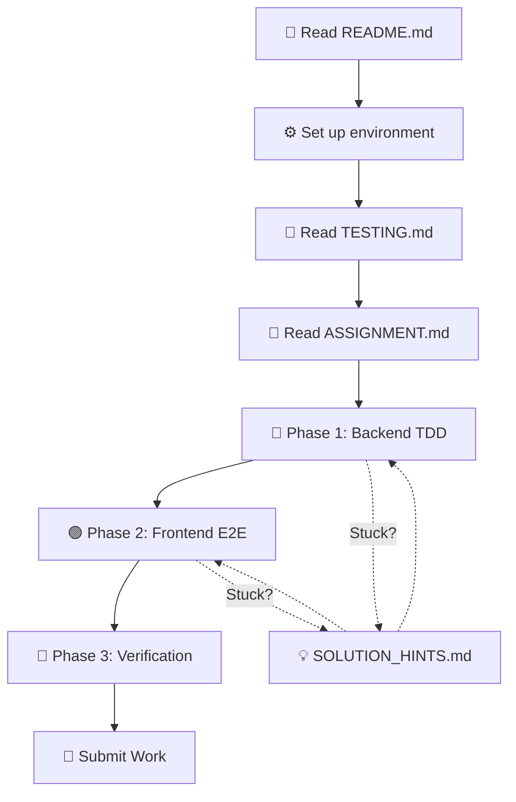

# Practice Exercise - Complete Documentation Index

A comprehensive learning resource for building full-stack applications with Quart (Python) and React, following production-ready patterns and Test-Driven Development (TDD).

## 📚 Documentation Overview

### 🚀 Getting Started (Start Here!)

1. **[README.md](./README.md)** ⭐ **START HERE**
   - Comprehensive setup guide
   - Detailed explanations of every step
   - Technology stack overview
   - Project structure breakdown
   - How Quart serves React (critical concept)
   - Testing setup
   - Troubleshooting guide

### 📝 Assignment & Exercises

2. **[ASSIGNMENT.md](./ASSIGNMENT.md)** 🎯 **MAIN ASSIGNMENT**

   - Complete coding assignment with 3 phases
   - Step-by-step TDD workflow
   - Backend API implementation
   - Frontend React implementation
   - Verification checklist
   - Submission guidelines

3. **[SOLUTION_HINTS.md](./SOLUTION_HINTS.md)** 💡
   - Progressive hints (no spoilers!)
   - Common patterns and examples
   - Debugging tips
   - What to do when stuck

### 🧪 Testing & Quality

4. **[TESTING.md](./TESTING.md)**
   - Comprehensive testing guide
   - pytest unit testing patterns
   - Playwright E2E testing
   - TDD methodology explained
   - Mock patterns
   - Best practices
   - Troubleshooting tests

### 🛠️ Setup & Configuration

5. **[FOLDER_CHECKLIST.md](./FOLDER_CHECKLIST.md)**
   - Complete folder structure
   - File creation checklist
   - Instructor setup guide
   - Quality checklist

## 🗂️ Configuration Files

All configuration files are ready to use:

- **`.env.example`** - Environment variables template
- **`pytest.ini`** - pytest configuration
- **`pyproject.toml`** - Python project configuration
- **`scripts/init_db.py`** - Database initialization script
- **`scripts/run_tests.sh`** - Automated test runner

## 🎓 Learning Path

### For Students



**Recommended Order**:

1. 📖 [README.md](./README.md) - Complete setup and understand architecture (30 min)
2. 🧪 [TESTING.md](./TESTING.md) - Learn testing patterns (30 min)
3. 🎯 [ASSIGNMENT.md](./ASSIGNMENT.md) - Start coding! (6-8 hours)
4. 💡 [SOLUTION_HINTS.md](./SOLUTION_HINTS.md) - Use when stuck

**Estimated Time**: 7-9 hours total

### For Instructors

1. **Setup Phase**:

   - Follow [FOLDER_CHECKLIST.md](./FOLDER_CHECKLIST.md)
   - Create starter files with TODOs
   - Create solution branch
   - Test the exercise end-to-end

2. **Delivery Phase**:

   - Share [README.md](./README.md) for initial setup and architecture overview
   - Assign [ASSIGNMENT.md](./ASSIGNMENT.md)
   - Reference [TESTING.md](./TESTING.md) for testing questions
   - Provide [SOLUTION_HINTS.md](./SOLUTION_HINTS.md) as needed

3. **Review Phase**:
   - Check Git history shows TDD pattern
   - Verify all tests pass
   - Review code quality
   - Provide feedback on patterns

## 📦 What You'll Build

A **Task Management API** with:

### Backend Features

- ✅ RESTful API with Quart
- ✅ CRUD operations for tasks
- ✅ SQLite database
- ✅ Input validation
- ✅ Error handling
- ✅ Blueprint architecture
- ✅ Comprehensive unit tests

### Frontend Features

- ✅ React 18 + TypeScript
- ✅ Task list view
- ✅ Task creation form
- ✅ Form validation
- ✅ Error handling
- ✅ API integration
- ✅ E2E tests with Playwright

### Testing Coverage

- ✅ Unit tests with pytest
- ✅ E2E tests with Playwright
- ✅ 80%+ code coverage
- ✅ TDD workflow demonstrated

## 🎯 Learning Objectives

After completing this exercise, students will:

### Technical Skills

- ✅ Build async API endpoints with Quart
- ✅ Create React components with TypeScript
- ✅ Write comprehensive unit tests with pytest
- ✅ Write E2E tests with Playwright
- ✅ Understand Blueprint architecture pattern
- ✅ Implement proper error handling
- ✅ Follow REST API best practices

### Methodologies

- ✅ Practice Test-Driven Development (TDD)
- ✅ Follow Red-Green-Refactor cycle
- ✅ Write tests before implementation
- ✅ Use Git workflow effectively
- ✅ Debug test failures systematically

### Architecture Understanding

- ✅ How Quart serves React SPA
- ✅ Development vs production mode
- ✅ API-frontend separation
- ✅ Testing pyramid concept
- ✅ Mock patterns for testing

## 🛠️ Technology Stack

### Backend

- **Quart 0.20.0** - Async Python web framework
- **SQLite** - Database (via aiosqlite)
- **pytest** - Testing framework
- **Hypercorn** - ASGI server

### Frontend

- **React 18.3.1** - UI library
- **TypeScript 5+** - Type safety
- **Vite 5+** - Build tool
- **Playwright** - E2E testing

### Tools

- **Git** - Version control
- **ruff** - Python linter
- **black** - Code formatter
- **ESLint** - JavaScript linter

## 📋 Quick Commands Reference

### Setup

```bash
# Backend
python -m venv venv
source venv/bin/activate
pip install -r requirements.txt
python scripts/init_db.py

# Frontend
cd app/frontend
npm install
```

### Development

```bash
# Terminal 1 - Backend
cd app/backend
hypercorn main:app --bind 0.0.0.0:5000 --reload

# Terminal 2 - Frontend
cd app/frontend
npm run dev
```

### Testing

```bash
# Unit tests
pytest tests/unit/ -v

# E2E tests (requires backend running)
pytest tests/e2e/ -m e2e --headed

# Coverage
pytest --cov=app/backend --cov-report=html

# Run all tests (script)
./scripts/run_tests.sh all
```

### Production Build

```bash
# Build frontend
cd app/frontend
npm run build

# Run backend (serves both)
cd ../backend
hypercorn main:app --bind 0.0.0.0:5000
```

## 📚 Additional Resources

### Official Documentation

- [Quart Documentation](https://quart.palletsprojects.com/)
- [React Documentation](https://react.dev/)
- [pytest Documentation](https://docs.pytest.org/)
- [Playwright Documentation](https://playwright.dev/python/)

### Patterns Reference

- Main project: `/app/backend/` - Real production patterns
- Reviews module: `/app/backend/reviews/` - Blueprint example
- Tests: `/tests/unit/` - Test patterns

### TDD Resources

- [Test-Driven Development](https://testdriven.io/test-driven-development/)
- [Red-Green-Refactor](https://www.codecademy.com/article/tdd-red-green-refactor)

## 🆘 Getting Help

### If You're Stuck

1. **Check the error message** - It usually tells you what's wrong
2. **Review relevant documentation**:
   - Setup issues → [README.md](./README.md)
   - Test failures → [TESTING.md](./TESTING.md)
   - Implementation hints → [SOLUTION_HINTS.md](./SOLUTION_HINTS.md)
3. **Check main project patterns** - See how similar features are implemented
4. **Debug systematically**:
   - Add print statements / console.logs
   - Use debugger (breakpoint() / browser dev tools)
   - Check test output carefully
5. **Ask for help** with specific error messages

### Common Issues

- **Port in use**: `lsof -ti:5000 | xargs kill -9`
- **Module not found**: Activate venv, reinstall dependencies
- **Database locked**: `rm *.db && python scripts/init_db.py`
- **Tests fail**: Check database is clean, review test patterns

## ✅ Success Criteria

Your assignment is complete when:

- ✅ All backend unit tests pass
- ✅ All E2E tests pass
- ✅ Application runs without errors
- ✅ Code follows project patterns
- ✅ Git commits show TDD workflow
- ✅ Code coverage ≥ 80%

## 🎉 What's Next?

After completing the basic assignment:

### Advanced Challenges

1. Add filtering and sorting
2. Add pagination
3. Add search functionality
4. Add user authentication (follow main project patterns)
5. Add task categories/tags
6. Add due dates and reminders
7. Deploy to cloud platform

### Study Main Project

- Review Azure integrations
- Study multi-tenant architecture
- Learn Cosmos DB patterns
- Explore AI integrations

---

## 📄 Document Quick Reference

| Document                                     | Purpose                   | When to Read                      |
| -------------------------------------------- | ------------------------- | --------------------------------- |
| [README.md](./README.md)                     | Comprehensive setup guide | First, for setup and architecture |
| [ASSIGNMENT.md](./ASSIGNMENT.md)             | Coding assignment         | When ready to code                |
| [TESTING.md](./TESTING.md)                   | Testing patterns          | Before writing tests              |
| [SOLUTION_HINTS.md](./SOLUTION_HINTS.md)     | Progressive hints         | When stuck                        |
| [FOLDER_CHECKLIST.md](./FOLDER_CHECKLIST.md) | Setup checklist           | Instructor setup                  |

---

**Ready to start? Head to [README.md](./README.md) for setup!** 🚀

**Questions? Check [SOLUTION_HINTS.md](./SOLUTION_HINTS.md)** 💡

**Happy coding!** 🎉
