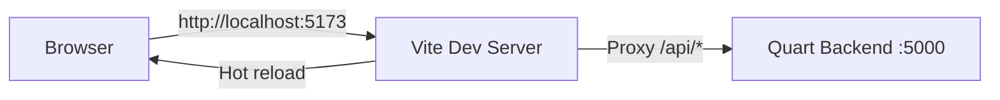
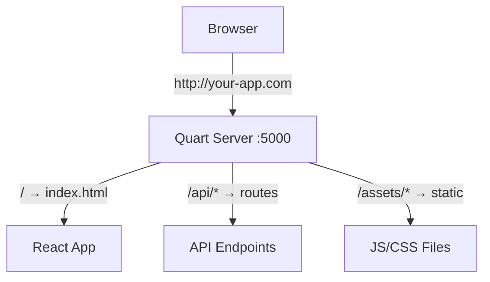
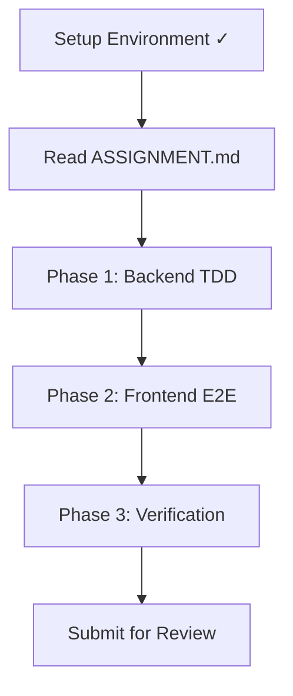

# Quart + React Practice Exercise - Setup Guide

A hands-on learning project that teaches modern full-stack development using **Quart** (async Python web framework) and **React** (with Vite), following production-ready patterns and Test-Driven Development (TDD).

## Table of Contents

1. [Overview](#overview)
2. [Technology Stack](#technology-stack)
3. [Project Structure](#project-structure)
4. [Prerequisites](#prerequisites)
5. [Environment Setup](#environment-setup)
6. [How Quart Serves React](#how-quart-serves-react)
7. [Testing Setup](#testing-setup)
8. [Running the Application](#running-the-application)
9. [Next Steps](#next-steps)

---

## Overview

This practice exercise teaches you to build a **Task Management API** using:

- **Backend**: Quart (Python async framework similar to Flask)
- **Frontend**: React 18 + TypeScript + Vite
- **Testing**: pytest (backend unit tests) + Playwright (E2E tests)
- **Database**: SQLite (for simplicity in learning)

You'll learn the **exact same patterns** used in production applications:

- Blueprint-based modular architecture
- Test-Driven Development (TDD)
- Single-deployment artifact (React compiled into Quart's static folder)
- Comprehensive testing strategy

---

## Technology Stack

### Backend Stack

| Technology         | Version  | Purpose                      |
| ------------------ | -------- | ---------------------------- |
| **Python**         | 3.11+    | Programming language         |
| **Quart**          | 0.20.0   | Async web framework          |
| **pytest**         | Latest   | Testing framework            |
| **pytest-asyncio** | Latest   | Async test support           |
| **SQLite**         | Built-in | Database (learning purposes) |
| **Hypercorn**      | Latest   | ASGI server                  |

### Frontend Stack

| Technology     | Version | Purpose            |
| -------------- | ------- | ------------------ |
| **Node.js**    | 18+     | JavaScript runtime |
| **React**      | 18.3.1  | UI library         |
| **TypeScript** | 5+      | Type safety        |
| **Vite**       | 5+      | Build tool         |
| **Playwright** | Latest  | E2E testing        |

### Development Tools

```bash
# Backend linting and formatting
ruff         # Fast Python linter
black        # Code formatter

# Frontend tooling (included in package.json)
eslint       # JavaScript linter
prettier     # Code formatter
```

---

## Project Structure

This project replicates the **exact folder structure** from the main Producction application:

```
practice-exercise/
├── app/
│   ├── backend/                    # Python Quart backend
│   │   ├── app.py                 # Main application factory
│   │   ├── config.py              # Configuration constants
│   │   ├── decorators.py          # Route decorators
│   │   ├── error.py               # Error handling
│   │   ├── main.py                # Application entry point
│   │   │
│   │   ├── core/                  # Core utilities
│   │   │   └── database.py        # Database connection/helpers
│   │   │
│   │   ├── tasks/                 # Task management module (YOU BUILD THIS)
│   │   │   ├── __init__.py
│   │   │   ├── routes.py          # Task API endpoints
│   │   │   └── models.py          # Task data models
│   │   │
│   │   ├── static/                # Compiled React build (auto-generated)
│   │   │   ├── index.html
│   │   │   └── assets/
│   │   │
│   │   └── requirements.txt       # Python dependencies
│   │
│   └── frontend/                   # React + TypeScript frontend
│       ├── src/
│       │   ├── pages/             # Page components
│       │   │   └── Tasks.tsx      # Tasks page (YOU BUILD THIS)
│       │   │
│       │   ├── components/        # Reusable components
│       │   │   ├── TaskForm.tsx   # Task creation form
│       │   │   └── TaskList.tsx   # Task list display
│       │   │
│       │   ├── api/               # API client functions
│       │   │   └── tasks.ts       # Task API calls
│       │   │
│       │   ├── types/             # TypeScript types
│       │   │   └── task.ts        # Task type definitions
│       │   │
│       │   ├── App.tsx            # Root component
│       │   └── main.tsx           # Entry point
│       │
│       ├── vite.config.ts         # Vite configuration
│       ├── package.json           # Node dependencies
│       └── tsconfig.json          # TypeScript config
│
├── tests/                          # Test suites
│   ├── unit/                      # Backend unit tests
│   │   ├── conftest.py            # Shared test fixtures
│   │   └── test_tasks.py          # Task endpoint tests (YOU BUILD THIS)
│   │
│   └── e2e/                       # End-to-end tests
│       ├── conftest.py            # Playwright fixtures
│       └── test_tasks.py          # Task UI tests (YOU BUILD THIS)
│
├── scripts/                        # Utility scripts
│   └── init_db.py                 # Database initialization
│
├── .env.example                   # Example environment variables
├── pyproject.toml                 # Python project config
└── pytest.ini                     # pytest configuration
```

### Directory Purposes

#### Backend Directories

**`app/backend/`** - Root of Python application

- **Purpose**: Contains all server-side code
- **Files**: Main application setup, configuration, entry points

**`app/backend/core/`** - Core utilities

- **Purpose**: Shared utilities used across the application
- **Files**: Database helpers, common functions
- **Naming**: Generic utility names (e.g., `database.py`, `auth.py`)

**`app/backend/tasks/`** - Task feature module (Blueprint)

- **Purpose**: All task-related functionality
- **Files**:
  - `routes.py` - API endpoints for tasks
  - `models.py` - Task data models and database interactions
  - `__init__.py` - Module initialization
- **Pattern**: Each feature gets its own folder with this structure

**`app/backend/static/`** - Compiled React build

- **Purpose**: Serves the React frontend
- **Generated by**: `npm run build` (DO NOT edit manually)
- **Files**: `index.html`, `assets/*.js`, `assets/*.css`

#### Frontend Directories

**`app/frontend/src/pages/`** - Page components

- **Purpose**: Top-level route components
- **Naming**: PascalCase matching route name (e.g., `Tasks.tsx`, `Dashboard.tsx`)
- **Pattern**: One component per page, handles layout and data fetching

**`app/frontend/src/components/`** - Reusable components

- **Purpose**: UI components used across multiple pages
- **Naming**: PascalCase descriptive names (e.g., `TaskForm.tsx`, `Button.tsx`)
- **Pattern**: Small, focused, reusable components

**`app/frontend/src/api/`** - API client functions

- **Purpose**: All backend API calls
- **Naming**: Lowercase matching resource (e.g., `tasks.ts`, `users.ts`)
- **Pattern**: Exported async functions for each endpoint

**`app/frontend/src/types/`** - TypeScript types

- **Purpose**: Shared type definitions
- **Naming**: Lowercase matching domain (e.g., `task.ts`, `user.ts`)
- **Pattern**: Export interfaces and types

#### Test Directories

**`tests/unit/`** - Backend unit tests

- **Purpose**: Test individual functions and endpoints
- **Naming**: `test_*.py` matching module name (e.g., `test_tasks.py`)
- **Pattern**: pytest async tests with mocked dependencies

**`tests/e2e/`** - End-to-end tests

- **Purpose**: Test complete user flows in browser
- **Naming**: `test_*.py` matching feature (e.g., `test_tasks.py`)
- **Pattern**: Playwright tests with page object pattern

---

## Prerequisites

### Required Software

1. **Python 3.11 or higher**

   ```bash
   # Check version
   python --version  # or python3 --version

   # Install from https://www.python.org/downloads/
   ```

2. **Node.js 18 or higher**

   ```bash
   # Check version
   node --version

   # Install from https://nodejs.org/
   # Or use nvm: https://github.com/nvm-sh/nvm
   ```

3. **Git**

   ```bash
   # Check version
   git --version

   # Install from https://git-scm.com/
   ```

4. **Code Editor** (recommended)
   - **VS Code**: https://code.visualstudio.com/
   - Extensions:
     - Python (Microsoft)
     - Pylance (Microsoft)
     - ESLint (Microsoft)
     - Prettier (Prettier)

### Verify Prerequisites

```bash
# Check all tools are installed
python --version   # Should show 3.11 or higher
node --version     # Should show 18 or higher
npm --version      # Should show 9 or higher
git --version      # Should show any recent version
```

---

## Environment Setup

### Step 1: Clone the Repository

```bash
# Clone the exercise repository
git clone [EXERCISE_REPOSITORY_URL](https://github.com/maacaro/quart-react-exercise.git)
cd quart-react-exercise

# Ensure you're on develop branch
git checkout develop
git pull origin develop
```

### Step 2: Backend Setup (Python)

```bash
# 1. Create a virtual environment
python -m venv venv

# 2. Activate virtual environment
# On macOS/Linux:
source venv/bin/activate

# On Windows:
venv\Scripts\activate

# You should see (venv) in your terminal prompt

# 3. Upgrade pip
pip install --upgrade pip

# 4. Install dependencies
pip install -r app/backend/requirements.txt

# 5. Verify installation
python -c "import quart; print(f'Quart {quart.__version__} installed')"
pytest --version
```

**Backend Dependencies** (`app/backend/requirements.txt`):

```txt
# Web Framework
quart==0.20.0
quart-cors==0.7.0
hypercorn==0.17.3

# Database
aiosqlite==0.19.0

# Testing
pytest==7.4.3
pytest-asyncio==0.21.1
pytest-cov==4.1.0

# Development
ruff==0.1.6
black==23.11.0
```

### Step 3: Frontend Setup (Node.js)

```bash
# Navigate to frontend directory
cd app/frontend

# 1. Install dependencies
npm install

# 2. Verify installation
npm list react vite playwright

# 3. Return to project root
cd ../..
```

**Frontend Dependencies** (`app/frontend/package.json`):

```json
{
  "name": "task-management-app",
  "version": "1.0.0",
  "type": "module",
  "scripts": {
    "dev": "vite",
    "build": "vite build",
    "preview": "vite preview",
    "test:e2e": "pytest ../../tests/e2e/"
  },
  "dependencies": {
    "react": "^18.3.1",
    "react-dom": "^18.3.1",
    "react-router-dom": "^7.5.1"
  },
  "devDependencies": {
    "@types/react": "^18.3.1",
    "@types/react-dom": "^18.3.0",
    "@vitejs/plugin-react": "^4.2.1",
    "typescript": "^5.3.3",
    "vite": "^5.0.8",
    "eslint": "^8.55.0",
    "prettier": "^3.1.1"
  }
}
```

### Step 4: Environment Variables

```bash
# 1. Copy example environment file
cp .env.example .env

# 2. Edit .env with your preferred editor
# (The defaults should work for local development)
```

**`.env.example`** contents:

```bash
# Database Configuration
DATABASE_URL=sqlite:///app.db

# Application Configuration
SECRET_KEY=dev-secret-key-change-in-production
DEBUG=true

# Server Configuration
BACKEND_PORT=5000
FRONTEND_PORT=5173

# CORS Configuration
ALLOWED_ORIGINS=http://localhost:5173

# Test Database (used by pytest)
TEST_DATABASE_URL=sqlite:///test.db
```

**Environment Variable Explanations**:

| Variable            | Purpose                   | Default                 | Notes                         |
| ------------------- | ------------------------- | ----------------------- | ----------------------------- |
| `DATABASE_URL`      | SQLite database file path | `sqlite:///app.db`      | Main application database     |
| `SECRET_KEY`        | Session encryption key    | `dev-secret-key...`     | **MUST change in production** |
| `DEBUG`             | Enable debug mode         | `true`                  | Set to `false` in production  |
| `BACKEND_PORT`      | Quart server port         | `5000`                  | Backend API listens here      |
| `FRONTEND_PORT`     | Vite dev server port      | `5173`                  | Frontend dev server           |
| `ALLOWED_ORIGINS`   | CORS allowed origins      | `http://localhost:5173` | Comma-separated list          |
| `TEST_DATABASE_URL` | Test database path        | `sqlite:///test.db`     | Separate DB for tests         |

### Step 5: Initialize Database

```bash
# Run database initialization script
python scripts/init_db.py

# You should see:
# "Database initialized successfully!"
# "Created tables: tasks"
```

**What this does**:

- Creates SQLite database file
- Creates `tasks` table with schema
- Seeds sample data (optional)

### Step 6: Verify Setup

```bash
# 1. Test backend
cd app/backend
hypercorn main:app --bind 0.0.0.0:5000

# Open http://localhost:5000 in browser
# You should see: {"message": "Task Management API"}

# Stop with Ctrl+C

# 2. Test frontend
cd ../frontend
npm run dev

# Open http://localhost:5173 in browser
# You should see the React app

# Stop with Ctrl+C
```

---

## How Quart Serves React

Understanding how the backend serves the frontend is crucial to this architecture.

### Development Mode (Two Servers)

During development, you run **two separate servers**:



**Vite Dev Server** (`:5173`):

- Serves React app with hot module reload
- Proxies API requests to Quart backend
- Source maps for debugging

**Quart Backend** (`:5000`):

- Handles API requests
- Not serving frontend in dev mode

**Vite Proxy Configuration** (`app/frontend/vite.config.ts`):

```typescript
import { defineConfig } from "vite";
import react from "@vitejs/plugin-react";

export default defineConfig({
  plugins: [react()],
  server: {
    port: 5173,
    proxy: {
      // Proxy API requests to Quart backend
      "/api": {
        target: "http://localhost:5000",
        changeOrigin: true,
      },
    },
  },
  build: {
    // Output to backend static folder
    outDir: "../backend/static",
    emptyOutDir: true,
  },
});
```

### Production Mode (Single Server)

In production, **one server** serves everything:



**Build Process**:

```bash
# 1. Build React app
cd app/frontend
npm run build

# Vite outputs to: app/backend/static/
# ├── index.html
# ├── assets/
# │   ├── index-abc123.js
# │   └── index-xyz789.css

# 2. Quart serves these files
cd ../backend
python main.py  # or hypercorn main:app
```

**Quart Static File Routes** (`app/backend/app.py`):

```python
from quart import Quart, Blueprint, send_from_directory
from pathlib import Path

# Create blueprint with static folder
bp = Blueprint("main", __name__, static_folder="static")

@bp.route("/")
async def index():
    """Serve React app entry point"""
    return await bp.send_static_file("index.html")

@bp.route("/assets/<path:path>")
async def assets(path: str):
    """Serve compiled JS/CSS bundles"""
    static_dir = Path(__file__).parent / "static" / "assets"
    return await send_from_directory(static_dir, path)

# For SPA routing - all non-API routes serve index.html
@bp.route("/<path:path>")
async def catch_all(path: str):
    """Catch-all route for React Router"""
    if not path.startswith("api"):
        return await bp.send_static_file("index.html")
    return {"error": "Not found"}, 404
```

### SPA Routing Explained

React Router uses **client-side routing**:

- Routes like `/tasks`, `/tasks/123` are handled by React
- These URLs don't exist on the server
- Server must return `index.html` for all non-API routes
- React Router then handles the route client-side

**Example Flow**:

1. User navigates to `http://localhost:5000/tasks`
2. Quart's catch-all route serves `index.html`
3. React loads and React Router sees `/tasks`
4. React Router renders `<Tasks>` component

---

## Testing Setup

### pytest Configuration

**File**: `pytest.ini` (or `pyproject.toml`)

```ini
[pytest]
# Test discovery patterns
python_files = test_*.py
python_classes = Test*
python_functions = test_*

# Minimum Python version
minversion = 7.0

# Command line options
addopts =
    -ra                  # Show summary of all test outcomes
    -vv                  # Very verbose output
    --strict-markers     # Error on unknown markers
    --tb=short           # Shorter traceback format

# Async test configuration
asyncio_mode = strict

# Test paths
testpaths = tests

# Markers (for organizing tests)
markers =
    unit: Unit tests for backend logic
    e2e: End-to-end tests with Playwright
    slow: Tests that take a long time
```

### Test Database Configuration

**Pattern**: Use a separate test database to avoid corrupting development data.

**File**: `tests/unit/conftest.py`

```python
import pytest
import os
from pathlib import Path

@pytest.fixture(scope="session", autouse=True)
def setup_test_environment():
    """Configure test environment before any tests run"""
    # Set test database URL
    os.environ["DATABASE_URL"] = "sqlite:///test.db"
    os.environ["TESTING"] = "true"

    yield

    # Cleanup after all tests
    test_db = Path("test.db")
    if test_db.exists():
        test_db.unlink()

@pytest.fixture
async def test_db():
    """Provide clean database for each test"""
    from app.backend.core.database import init_db, clear_db

    # Initialize fresh database
    await init_db()

    yield

    # Clear after test
    await clear_db()

@pytest.fixture
async def test_client(test_db):
    """Provide Quart test client"""
    from app.backend.app import create_app

    app = create_app()

    async with app.test_client() as client:
        yield client
```

### Playwright Configuration

**File**: `tests/e2e/conftest.py`

```python
import pytest
from playwright.sync_api import sync_playwright

@pytest.fixture(scope="session")
def browser():
    """Launch browser for E2E tests"""
    with sync_playwright() as p:
        browser = p.chromium.launch(
            headless=True,  # Set to False to watch tests
            slow_mo=100     # Slow down by 100ms for visibility
        )
        yield browser
        browser.close()

@pytest.fixture
def page(browser):
    """Provide new page for each test"""
    context = browser.new_context()
    page = context.new_page()

    # Navigate to app
    page.goto("http://localhost:5173")

    yield page

    page.close()
    context.close()

@pytest.fixture
def mock_database():
    """Mock database with test data for E2E tests"""
    # This fixture ensures E2E tests use test database
    # Implementation depends on your database setup
    pass
```

### Running Tests

```bash
# Run all tests
pytest

# Run only unit tests
pytest tests/unit/ -m unit

# Run only E2E tests (requires app running)
pytest tests/e2e/ -m e2e

# Run with coverage
pytest --cov=app/backend --cov-report=html

# Run in verbose mode
pytest -vv

# Run specific test file
pytest tests/unit/test_tasks.py

# Run specific test function
pytest tests/unit/test_tasks.py::test_create_task_success

# Watch mode (requires pytest-watch)
ptw  # Reruns tests on file changes
```

---

## Running the Application

### Development Mode (Recommended for Learning)

**Terminal 1 - Backend**:

```bash
# From project root
source venv/bin/activate  # Activate virtual environment

cd app/backend
hypercorn main:app --bind 0.0.0.0:5000 --reload

# Backend running at: http://localhost:5000
# API docs: http://localhost:5000/api (if implemented)
```

**Terminal 2 - Frontend**:

```bash
# From project root
cd app/frontend
npm run dev

# Frontend running at: http://localhost:5173
```

**Access**:

- **Frontend**: http://localhost:5173
- **Backend API**: http://localhost:5000/api

### Production Mode (Single Server)

```bash
# 1. Build frontend
cd app/frontend
npm run build

# 2. Run backend (serves both API and frontend)
cd ../backend
hypercorn main:app --bind 0.0.0.0:5000

# Access everything at: http://localhost:5000
```

### Common Issues & Solutions

#### Issue: Port already in use

```bash
# Error: Address already in use

# Solution: Kill process on port
# macOS/Linux:
lsof -ti:5000 | xargs kill -9
lsof -ti:5173 | xargs kill -9

# Windows:
netstat -ano | findstr :5000
taskkill /PID <PID> /F
```

#### Issue: Database locked

```bash
# Error: database is locked

# Solution: Close all connections and restart
rm app.db test.db
python scripts/init_db.py
```

#### Issue: Module not found

```bash
# Error: No module named 'quart'

# Solution: Activate virtual environment
source venv/bin/activate  # macOS/Linux
venv\Scripts\activate     # Windows

# Then reinstall
pip install -r app/backend/requirements.txt
```

#### Issue: React not loading

```bash
# Check Vite dev server is running
cd app/frontend
npm run dev

# Check proxy configuration in vite.config.ts
# Ensure backend is running on correct port
```

---

## Next Steps

Now that your environment is set up, proceed to the assignment:

1. **Read the Assignment**: [ASSIGNMENT.md](./ASSIGNMENT.md)
2. **Understand Testing**: [TESTING.md](./TESTING.md)
3. **Start Coding**: Follow Phase 0 in ASSIGNMENT.md

### Learning Path



### Additional Resources

**Quart Documentation**:

- Official docs: https://quart.palletsprojects.com/
- Tutorial: https://quart.palletsprojects.com/tutorials/

**React + Vite**:

- React docs: https://react.dev/
- Vite guide: https://vitejs.dev/guide/

**Testing**:

- pytest docs: https://docs.pytest.org/
- Playwright docs: https://playwright.dev/python/

**TDD Principles**:

- Red-Green-Refactor cycle
- Write failing test first
- Implement minimum code to pass
- Refactor for quality

### Getting Help

If you're stuck:

1. Check the error message carefully
2. Review relevant documentation sections
3. Check [TESTING.md](./TESTING.md) for test patterns
4. Ask for help with specific error messages

---

## Summary

You've successfully set up:

- ✅ Python 3.11+ virtual environment with Quart
- ✅ Node.js 18+ with React + Vite
- ✅ SQLite database
- ✅ pytest for backend testing
- ✅ Playwright for E2E testing
- ✅ Development and production configurations

**You're ready to start the assignment!** 🚀

Head to [ASSIGNMENT.md](./ASSIGNMENT.md) to begin building the Task Management API with TDD.
