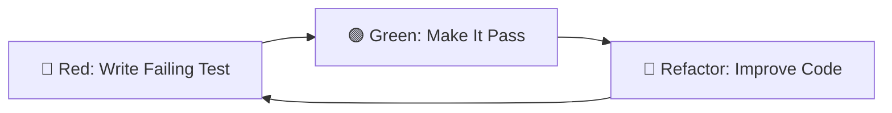

# Testing Guide

Comprehensive guide to testing patterns used in this project, covering unit tests (pytest) and end-to-end tests (Playwright).

## Table of Contents

1. [Testing Philosophy](#testing-philosophy)
2. [Testing Stack](#testing-stack)
3. [Unit Testing with pytest](#unit-testing-with-pytest)
4. [E2E Testing with Playwright](#e2e-testing-with-playwright)
5. [Test-Driven Development (TDD)](#test-driven-development-tdd)
6. [Mock Patterns](#mock-patterns)
7. [Best Practices](#best-practices)
8. [Troubleshooting](#troubleshooting)

---

## Testing Philosophy

### Why Test?

**Benefits of comprehensive testing**:
- 🐛 **Catch bugs early** - Find issues before production
- 📚 **Documentation** - Tests show how code should work
- 🔄 **Refactoring confidence** - Change code without fear
- 🎯 **Design feedback** - Hard to test = bad design
- 🚀 **Deployment confidence** - Deploy with certainty

### Testing Pyramid

```
         /\
        /  \
       / E2E \         Few E2E tests (slow, expensive)
      /______\
     /        \
    /Integration\      Some integration tests (medium speed)
   /____________\
  /              \
 /  Unit Tests    \    Many unit tests (fast, cheap)
/__________________\
```

**Our Strategy**:
- **70% Unit Tests** - Fast, isolated tests of individual functions
- **20% Integration Tests** - Test interaction between components
- **10% E2E Tests** - Test critical user flows in browser

---

## Testing Stack

### Backend Testing

```python
# Core testing tools
pytest==7.4.3              # Test framework
pytest-asyncio==0.21.1     # Async test support
pytest-cov==4.1.0          # Code coverage
pytest-watch==4.2.0        # Watch mode (optional)

# Mocking and fixtures
unittest.mock              # Built-in mocking (AsyncMock, MagicMock)
```

### Frontend Testing

```json
{
  "@playwright/test": "^1.40.0",  // E2E testing framework
  "pytest": "^7.4.3"              // Python test runner for Playwright
}
```

### Configuration Files

**Backend**: `pytest.ini` or `pyproject.toml`
**Frontend**: `tests/e2e/conftest.py`

---

## Unit Testing with pytest

Unit tests verify individual functions and endpoints in isolation.

### Test File Structure

```
tests/unit/
├── conftest.py              # Shared fixtures
├── test_tasks.py            # Task endpoint tests
├── test_database.py         # Database helper tests
└── test_models.py           # Model class tests
```

**Naming Conventions**:
- Files: `test_*.py` or `*_test.py`
- Functions: `test_*`
- Classes: `Test*` (optional)

### Basic Test Structure

```python
"""
Unit tests for task management endpoints.

Each test follows the Arrange-Act-Assert (AAA) pattern.
"""
import pytest
from app.backend.tasks.models import Task


@pytest.mark.asyncio  # Required for async tests
@pytest.mark.unit     # Custom marker for organization
async def test_create_task_success(test_client):
    """Test successful task creation.

    Docstring explains:
    - What is being tested
    - Expected behavior
    - Any important context
    """
    # Arrange - Set up test data
    task_data = {
        "title": "Test Task",
        "description": "Test Description",
        "status": "pending"
    }

    # Act - Perform the action
    response = await test_client.post("/api/tasks", json=task_data)

    # Assert - Verify the results
    assert response.status_code == 201
    data = await response.get_json()
    assert data["title"] == task_data["title"]
    assert data["id"] is not None
```

### Fixtures (conftest.py)

Fixtures provide reusable test setup and teardown.

**File**: `tests/unit/conftest.py`

```python
"""
Shared test fixtures for unit tests.

Fixtures are functions that run before tests to set up preconditions.
They can also clean up after tests (teardown).
"""
import pytest
import os
from pathlib import Path


@pytest.fixture(scope="session", autouse=True)
def setup_test_environment():
    """
    Configure test environment (runs once per test session).

    Scope options:
    - session: Once per test run
    - module: Once per test file
    - function: Once per test function (default)

    autouse=True: Runs automatically without being requested
    """
    # Setup
    os.environ["DATABASE_URL"] = "sqlite:///test.db"
    os.environ["TESTING"] = "true"

    yield  # Tests run here

    # Teardown
    test_db = Path("test.db")
    if test_db.exists():
        test_db.unlink()


@pytest.fixture
async def test_db():
    """
    Provide clean database for each test.

    This fixture:
    1. Initializes fresh database
    2. Yields control to test
    3. Clears database after test

    Usage:
        async def test_something(test_db):
            # test_db is ready to use
    """
    from app.backend.core.database import init_db, clear_db

    await init_db()
    yield
    await clear_db()


@pytest.fixture
async def test_client(test_db):
    """
    Provide Quart test client with clean database.

    Test client allows making HTTP requests to app without running server.

    Usage:
        async def test_endpoint(test_client):
            response = await test_client.get("/api/tasks")
            assert response.status_code == 200
    """
    from app.backend.app import create_app

    app = create_app()

    async with app.test_client() as client:
        yield client


@pytest.fixture
def sample_task():
    """
    Provide sample task data for tests.

    Simple fixture that returns data (no setup/teardown).

    Usage:
        def test_something(sample_task):
            assert sample_task["title"] == "Sample Task"
    """
    return {
        "title": "Sample Task",
        "description": "Sample Description",
        "status": "pending"
    }
```

### Testing Patterns

#### Pattern 1: Testing Success Cases

```python
@pytest.mark.asyncio
async def test_get_all_tasks(test_client, test_db):
    """Test fetching all tasks."""
    # Arrange - Create test data
    await test_client.post("/api/tasks", json={"title": "Task 1"})
    await test_client.post("/api/tasks", json={"title": "Task 2"})

    # Act - Fetch tasks
    response = await test_client.get("/api/tasks")

    # Assert
    assert response.status_code == 200
    data = await response.get_json()
    assert len(data) == 2
    assert data[0]["title"] == "Task 1"
```

#### Pattern 2: Testing Error Cases

```python
@pytest.mark.asyncio
async def test_create_task_missing_title(test_client):
    """Test task creation fails without title."""
    # Arrange - Invalid data
    invalid_data = {
        "description": "No title provided"
    }

    # Act
    response = await test_client.post("/api/tasks", json=invalid_data)

    # Assert - Expect error
    assert response.status_code == 400
    data = await response.get_json()
    assert "error" in data
    assert "title" in data["error"].lower()
```

#### Pattern 3: Testing Not Found (404)

```python
@pytest.mark.asyncio
async def test_get_nonexistent_task(test_client):
    """Test fetching task that doesn't exist."""
    # Act - Request non-existent task
    response = await test_client.get("/api/tasks/99999")

    # Assert - Expect 404
    assert response.status_code == 404
    data = await response.get_json()
    assert data["error"] == "Task not found"
```

#### Pattern 4: Parameterized Tests

Test same function with different inputs:

```python
@pytest.mark.parametrize("status,expected", [
    ("pending", True),
    ("in_progress", True),
    ("completed", True),
    ("invalid", False),
])
async def test_task_status_validation(test_client, status, expected):
    """Test task creation with different status values."""
    task_data = {
        "title": "Test",
        "status": status
    }

    response = await test_client.post("/api/tasks", json=task_data)

    if expected:
        assert response.status_code == 201
    else:
        assert response.status_code == 400
```

### Async Testing

**Important**: Always use `@pytest.mark.asyncio` for async tests.

```python
# ✅ Correct
@pytest.mark.asyncio
async def test_async_function():
    result = await some_async_function()
    assert result == expected

# ❌ Wrong - Will fail
async def test_async_function():  # Missing decorator!
    result = await some_async_function()
    assert result == expected
```

### Running Unit Tests

```bash
# Run all unit tests
pytest tests/unit/

# Run specific file
pytest tests/unit/test_tasks.py

# Run specific test
pytest tests/unit/test_tasks.py::test_create_task_success

# Run with verbose output
pytest tests/unit/ -v

# Run with coverage
pytest tests/unit/ --cov=app/backend --cov-report=html

# Run tests matching pattern
pytest tests/unit/ -k "create"

# Run only tests marked as 'unit'
pytest tests/unit/ -m unit

# Stop on first failure
pytest tests/unit/ -x

# Run in parallel (requires pytest-xdist)
pytest tests/unit/ -n auto
```

### Code Coverage

```bash
# Generate coverage report
pytest --cov=app/backend --cov-report=html

# Open report in browser
open htmlcov/index.html  # macOS
# or
start htmlcov/index.html  # Windows

# Coverage report shows:
# - Lines executed by tests (green)
# - Lines NOT executed (red)
# - Coverage percentage per file
```

**Target Coverage**: Aim for 80%+ coverage on critical code paths.

---

## E2E Testing with Playwright

End-to-end tests verify complete user flows in a real browser.

### Test File Structure

```
tests/e2e/
├── conftest.py              # Playwright fixtures
├── test_tasks.py            # Task management flows
└── test_navigation.py       # Navigation tests
```

### Basic E2E Test Structure

```python
"""
End-to-end tests for task management.

These tests simulate real user interactions in a browser.
"""
import pytest
from playwright.sync_api import Page, expect


@pytest.mark.e2e
def test_create_task_flow(page: Page):
    """
    Test complete task creation flow.

    Simulates:
    1. User navigates to tasks page
    2. User clicks "New Task" button
    3. User fills in form
    4. User submits form
    5. User sees success message
    6. User sees new task in list
    """
    # Navigate to page
    page.goto("http://localhost:5173/tasks")

    # Wait for page to load
    expect(page.locator("h1")).to_contain_text("Tasks")

    # Click "New Task" button
    page.click('[data-testid="new-task-btn"]')

    # Fill form
    page.fill('[data-testid="task-title-input"]', "Buy groceries")
    page.fill('[data-testid="task-description-input"]', "Milk, eggs, bread")
    page.select_option('[data-testid="task-status-select"]', "pending")

    # Submit form
    page.click('[data-testid="create-task-btn"]')

    # Verify success
    expect(page.locator('[data-testid="success-message"]')).to_be_visible()
    expect(page.locator('[data-testid="success-message"]')).to_contain_text("created")

    # Verify task appears in list
    expect(page.locator('[data-testid="task-card"]')).to_contain_text("Buy groceries")
```

### Playwright Fixtures

**File**: `tests/e2e/conftest.py`

```python
"""
Playwright fixtures for E2E tests.
"""
import pytest
from playwright.sync_api import sync_playwright, Browser, Page


@pytest.fixture(scope="session")
def browser():
    """
    Launch browser for E2E tests.

    Scope: session - Browser reused across all tests (faster)
    """
    with sync_playwright() as p:
        browser = p.chromium.launch(
            headless=False,  # Set to True for CI/CD
            slow_mo=100      # Slow down by 100ms (easier to watch)
        )
        yield browser
        browser.close()


@pytest.fixture
def page(browser: Browser):
    """
    Provide new page for each test.

    Each test gets fresh page (isolated state).
    """
    context = browser.new_context(
        viewport={"width": 1280, "height": 720},
        locale="en-US"
    )
    page = context.new_page()

    yield page

    page.close()
    context.close()


@pytest.fixture(autouse=True)
async def reset_database():
    """
    Reset database before each E2E test.

    Ensures tests start with known state.
    """
    from app.backend.core.database import clear_db, init_db

    await clear_db()
    await init_db()

    # Optionally seed data
    # await seed_test_data()

    yield

    # Cleanup after test
    await clear_db()
```

### Playwright Selectors

**Recommended: Use `data-testid` attributes**

```tsx
// In React component
<button data-testid="create-task-btn">Create Task</button>

// In test
page.click('[data-testid="create-task-btn"]')
```

**Other selector options**:

```python
# By text
page.click('text=Create Task')

# By role (accessible)
page.click('role=button[name="Create Task"]')

# By CSS selector
page.click('button.primary')

# By ID
page.click('#submit-btn')

# Complex selector
page.click('form.task-form >> button[type="submit"]')
```

### Playwright Assertions

```python
from playwright.sync_api import expect

# Element visibility
expect(page.locator('[data-testid="task-list"]')).to_be_visible()
expect(page.locator('[data-testid="loading"]')).not_to_be_visible()

# Text content
expect(page.locator('h1')).to_contain_text("Tasks")
expect(page.locator('h1')).to_have_text("Tasks")  # Exact match

# Count
expect(page.locator('[data-testid="task-card"]')).to_have_count(3)

# Attributes
expect(page.locator('button')).to_be_disabled()
expect(page.locator('input')).to_have_value("Test")

# URL
expect(page).to_have_url("http://localhost:5173/tasks")
expect(page).to_have_title("Task Management")
```

### Common E2E Patterns

#### Pattern 1: Testing Form Submission

```python
@pytest.mark.e2e
def test_form_submission(page: Page):
    """Test form submission with validation."""
    page.goto("http://localhost:5173/tasks")

    # Open form
    page.click('[data-testid="new-task-btn"]')

    # Fill form
    page.fill('[data-testid="title-input"]', "Test Task")
    page.fill('[data-testid="description-input"]', "Description")

    # Submit
    page.click('[data-testid="submit-btn"]')

    # Wait for navigation or success message
    expect(page.locator('[data-testid="success"]')).to_be_visible()
```

#### Pattern 2: Testing Form Validation

```python
@pytest.mark.e2e
def test_form_validation(page: Page):
    """Test form shows validation errors."""
    page.goto("http://localhost:5173/tasks")

    page.click('[data-testid="new-task-btn"]')

    # Submit without filling required fields
    page.click('[data-testid="submit-btn"]')

    # Verify error message
    expect(page.locator('[data-testid="error"]')).to_be_visible()
    expect(page.locator('[data-testid="error"]')).to_contain_text("required")
```

#### Pattern 3: Testing API Integration

```python
@pytest.mark.e2e
def test_api_integration(page: Page):
    """Test frontend correctly calls backend API."""
    # Listen for API requests
    with page.expect_request("**/api/tasks") as request_info:
        page.goto("http://localhost:5173/tasks")

    request = request_info.value
    assert request.method == "GET"

    # Verify response is handled
    expect(page.locator('[data-testid="task-list"]')).to_be_visible()
```

#### Pattern 4: Testing User Flows

```python
@pytest.mark.e2e
def test_complete_task_workflow(page: Page):
    """Test complete workflow: create, update, delete task."""
    page.goto("http://localhost:5173/tasks")

    # Step 1: Create task
    page.click('[data-testid="new-task-btn"]')
    page.fill('[data-testid="title-input"]', "Test Task")
    page.click('[data-testid="submit-btn"]')
    expect(page.locator('text=Test Task')).to_be_visible()

    # Step 2: Update task status
    page.click('[data-testid="task-card"]')
    page.select_option('[data-testid="status-select"]', "completed")
    page.click('[data-testid="save-btn"]')
    expect(page.locator('text=completed')).to_be_visible()

    # Step 3: Delete task
    page.click('[data-testid="delete-btn"]')
    page.click('[data-testid="confirm-delete-btn"]')
    expect(page.locator('text=Test Task')).not_to_be_visible()
```

### Running E2E Tests

```bash
# Prerequisites: Backend must be running
cd app/backend
hypercorn main:app --bind 0.0.0.0:5000 &

# Run E2E tests
pytest tests/e2e/ -m e2e

# Run with visible browser (watch tests run)
pytest tests/e2e/ -m e2e --headed

# Run in slow motion (easier to debug)
pytest tests/e2e/ -m e2e --headed --slowmo 500

# Run specific test
pytest tests/e2e/test_tasks.py::test_create_task_flow --headed

# Run with Playwright UI (interactive debugging)
pytest tests/e2e/ --headed --debug
```

### Debugging E2E Tests

```python
# Take screenshot
page.screenshot(path="screenshot.png")

# Pause test and open browser inspector
page.pause()

# Print page content
print(page.content())

# Print element text
print(page.locator('[data-testid="error"]').text_content())

# Wait for manual inspection
import time
time.sleep(10)
```

---

## Test-Driven Development (TDD)

### The TDD Cycle



### Step-by-Step TDD Process

#### 1. 🔴 Red: Write a Failing Test

```python
# tests/unit/test_tasks.py

@pytest.mark.asyncio
async def test_create_task(test_client):
    """Test POST /api/tasks creates a task."""
    response = await test_client.post("/api/tasks", json={
        "title": "Test Task"
    })

    assert response.status_code == 201
    data = await response.get_json()
    assert data["title"] == "Test Task"
```

**Run the test**:
```bash
pytest tests/unit/test_tasks.py::test_create_task

# Output:
# FAILED - 404 Not Found (endpoint doesn't exist)
```

#### 2. 🟢 Green: Write Minimum Code to Pass

```python
# app/backend/tasks/routes.py

@tasks_bp.route("/api/tasks", methods=["POST"])
async def create_task():
    data = await request.get_json()
    # Minimal implementation
    return jsonify({"title": data["title"]}), 201
```

**Run the test again**:
```bash
pytest tests/unit/test_tasks.py::test_create_task

# Output:
# PASSED ✓
```

#### 3. 🔵 Refactor: Improve Code Quality

```python
# app/backend/tasks/routes.py

@tasks_bp.route("/api/tasks", methods=["POST"])
async def create_task():
    """Create a new task."""
    data = await request.get_json()

    # Add validation
    if not data or "title" not in data:
        return jsonify({"error": "Title is required"}), 400

    # Create task object
    task = Task(title=data["title"])
    created_task = await save_task(task)

    return jsonify(created_task.to_dict()), 201
```

**Run all tests**:
```bash
pytest tests/unit/

# All tests should still pass after refactoring
```

### TDD Benefits

1. **Design feedback** - Hard to test = bad design
2. **Documentation** - Tests show how code works
3. **Confidence** - Green tests = working code
4. **Refactoring safety** - Tests catch regressions
5. **Faster debugging** - Know exactly what broke

---

## Mock Patterns

Mocking replaces real dependencies with test doubles.

### When to Mock

✅ **Do mock**:
- External APIs (slow, unreliable)
- Databases (for some tests)
- File system operations
- Time-dependent code
- Email/SMS services

❌ **Don't mock**:
- Code you're testing
- Simple data structures
- Pure functions
- Value objects

### Mock Patterns with unittest.mock

#### Pattern 1: Mocking Async Functions

```python
from unittest.mock import AsyncMock

@pytest.fixture
def mock_database():
    """Mock database operations."""
    mock_db = AsyncMock()

    # Configure return values
    mock_db.insert_task.return_value = {
        "id": 1,
        "title": "Test Task"
    }

    return mock_db

async def test_with_mock_db(mock_database):
    """Test using mocked database."""
    result = await mock_database.insert_task("Test Task")

    assert result["id"] == 1
    mock_database.insert_task.assert_called_once_with("Test Task")
```

#### Pattern 2: Mocking Class Instances

```python
from unittest.mock import MagicMock, patch

@pytest.fixture
def mock_task():
    """Mock Task class."""
    task = MagicMock()
    task.id = 1
    task.title = "Test Task"
    task.to_dict.return_value = {"id": 1, "title": "Test Task"}

    return task
```

#### Pattern 3: Patching Imports

```python
from unittest.mock import patch

@patch('app.backend.tasks.models.insert_task')
async def test_create_task(mock_insert):
    """Test with patched function."""
    # Configure mock
    mock_insert.return_value = {"id": 1, "title": "Test"}

    # Test code that calls insert_task
    # ...

    # Verify mock was called
    mock_insert.assert_called_once()
```

#### Pattern 4: Side Effects

```python
mock_function = AsyncMock(side_effect=ValueError("Test error"))

# When called, mock raises ValueError
with pytest.raises(ValueError):
    await mock_function()
```

---

## Best Practices

### General Testing Principles

1. **Tests should be independent** - Each test can run alone
2. **Tests should be fast** - Unit tests < 1 second
3. **Tests should be deterministic** - Same result every time
4. **One assertion focus** - Test one thing at a time
5. **Clear test names** - Name describes what is tested

### Test Naming

```python
# ✅ Good - Descriptive, clear intent
def test_create_task_with_valid_data_returns_201():
    pass

def test_create_task_without_title_returns_400():
    pass

# ❌ Bad - Vague, unclear
def test_create():
    pass

def test_task_1():
    pass
```

### Test Organization

```python
# ✅ Good - Arrange-Act-Assert pattern

def test_something():
    # Arrange - Set up test data
    task_data = {"title": "Test"}

    # Act - Perform action
    result = create_task(task_data)

    # Assert - Verify result
    assert result.status_code == 201


# ❌ Bad - Mixed logic, unclear

def test_something():
    result = create_task({"title": "Test"})
    assert result.status_code == 201
    task_data = {"title": "Another test"}
    # Confusing flow
```

### Avoid Test Interdependence

```python
# ❌ Bad - Tests depend on each other

def test_create_task():
    global task_id
    response = create_task({"title": "Test"})
    task_id = response["id"]

def test_get_task():
    response = get_task(task_id)  # Depends on previous test!


# ✅ Good - Independent tests

@pytest.fixture
def created_task(test_client):
    response = await test_client.post("/api/tasks", json={"title": "Test"})
    return await response.get_json()

def test_get_task(test_client, created_task):
    response = await test_client.get(f"/api/tasks/{created_task['id']}")
    assert response.status_code == 200
```

---

## Troubleshooting

### Common Issues

#### Issue: Tests fail with "Event loop is closed"

**Cause**: Async fixture scope mismatch

**Solution**:
```python
# Use function scope for async fixtures
@pytest.fixture  # scope="function" is default
async def test_db():
    await init_db()
    yield
    await clear_db()
```

#### Issue: Playwright can't find elements

**Cause**: Element not loaded yet

**Solution**: Use explicit waits
```python
# ❌ Bad
page.click('[data-testid="button"]')  # Might fail if not loaded

# ✅ Good
page.wait_for_selector('[data-testid="button"]')
page.click('[data-testid="button"]')

# ✅ Better - expect automatically waits
expect(page.locator('[data-testid="button"]')).to_be_visible()
page.click('[data-testid="button"]')
```

#### Issue: Database locked error

**Cause**: Previous test didn't close connection

**Solution**: Ensure cleanup in fixtures
```python
@pytest.fixture
async def test_db():
    await init_db()
    yield
    await clear_db()  # Always cleanup
```

#### Issue: Tests pass individually but fail together

**Cause**: Shared state between tests

**Solution**: Reset state in fixtures
```python
@pytest.fixture(autouse=True)
async def reset_database():
    """Reset before each test."""
    await clear_db()
    await init_db()
    yield
```

### Debugging Tips

```bash
# Run with print statements visible
pytest -s

# Stop on first failure
pytest -x

# Show local variables on failure
pytest -l

# Run last failed tests
pytest --lf

# Drop into debugger on failure
pytest --pdb

# Verbose output
pytest -vv
```

---

## Summary

### Testing Checklist

- ✅ Write tests before implementation (TDD)
- ✅ Test success cases
- ✅ Test error cases
- ✅ Test edge cases
- ✅ Use descriptive test names
- ✅ Keep tests independent
- ✅ Mock external dependencies
- ✅ Aim for 80%+ code coverage
- ✅ Run tests frequently during development
- ✅ Commit tests separately from implementation

### Quick Reference

```bash
# Unit tests
pytest tests/unit/ -v

# E2E tests (requires backend running)
pytest tests/e2e/ -m e2e --headed

# Coverage
pytest --cov=app/backend --cov-report=html

# Watch mode
ptw

# Specific test
pytest tests/unit/test_tasks.py::test_create_task -v
```

**Happy testing!** 🧪
